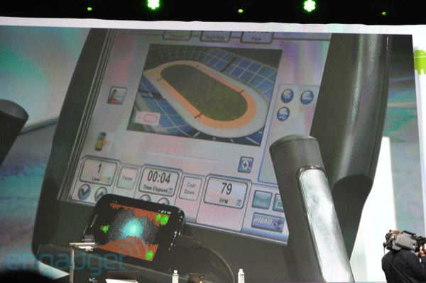

<!SLIDE smaller bullets incremental transition=fade>
.notes emddom
# aspects #

* flexible scope
  * down-to-earth  --> theoretical
* attract students
  * 'modern', leading (bleeding) edge, 'hip' 
    e.g. mobility, social, robotic
  * can have continuation in
    * further studies
    * career (looks good in CV)
* fits into allocated time
* tangible, demonstrable results
* is not object of a "holy war"
  * no way to defend:
    opponents divided and cannot be convinced

<!SLIDE smaller bullets transition=fade>
.notes Serge Abiteboul
# if you could see it with my eyes... #

* Digression: How to choose a thesis topic? [>>](http://www-rocq.inria.fr/~abitebou/PRESENTATION/HowToChooseAThesisTopoc-EDBT02.pdf) 
  Serge Abiteboul (Abiteboul-Vianu Theorem [>>](http://www.enotes.com/topic/Serge_Abiteboul))

<!SLIDE center transition=fadeZoom>
.notes how to put an image

